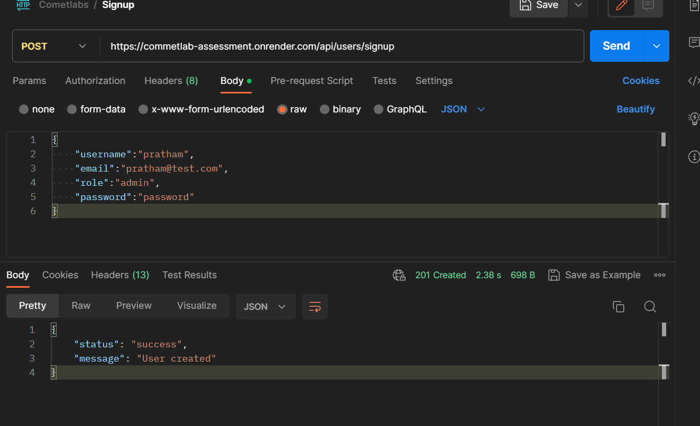
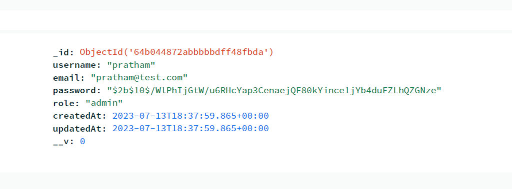
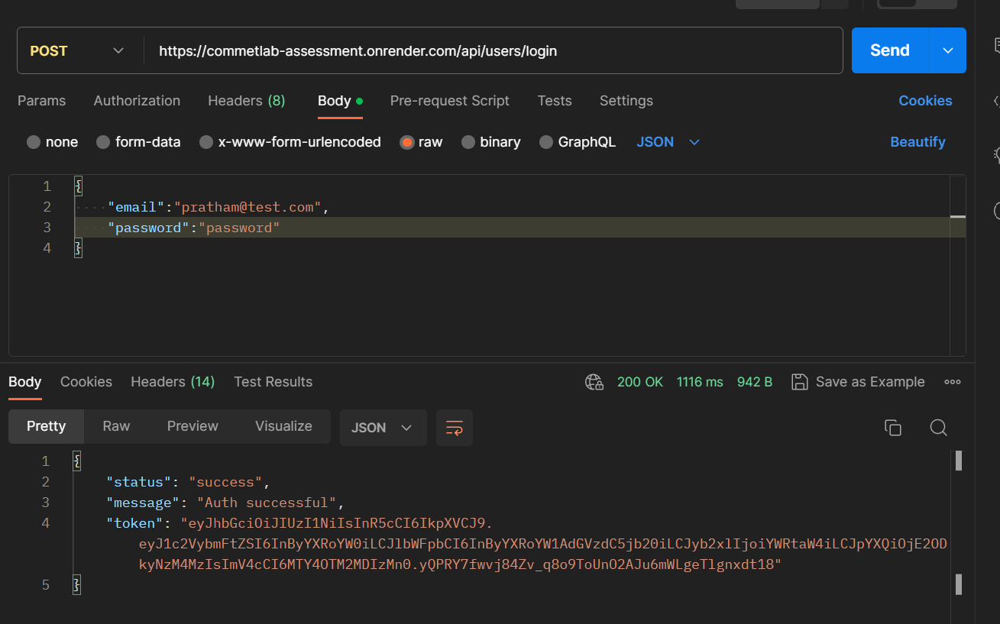
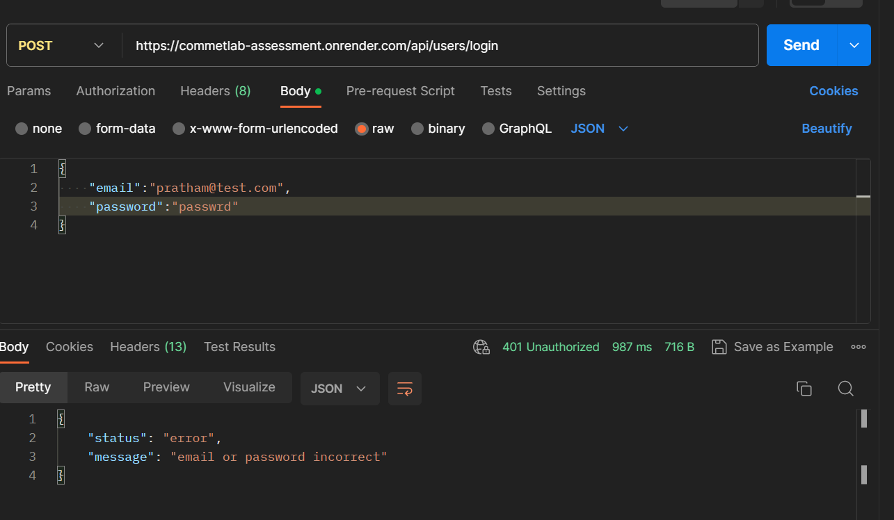
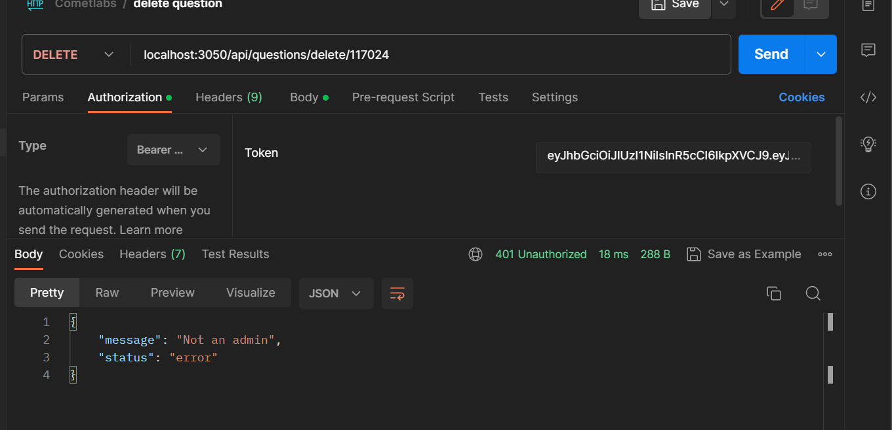

# Commetla Assessment
This repo contains some basic apis which does the following functionalities -
- Role-based authentication system for admin and participants.
- Create a middleware to differentiate admins from participants.
- A set of APIs for the admin to add, edit or delete the question.
- Storing questions in the DB.
- A set of APIs for the admin to add test cases to a question.
- An API that takes the solution from the user for a particular question.

## How to setup
For the backend folder
1. Clone the project by  and go to server folder<br>
```
git clone https://github.com/The-Developers-Den/cometlab-assessment.git
cd server
```
2. Make an env file and add your credentials
```
//In .env
PORT = 'Any Port...' 
MONGO_ATLAS_PW= 'Your Mongodb Key...' 
JWT_KEY = 'Your jwt private key...'
ACCESS_TOKEN = 'Your sphere-engine access token'
ENDPOINT ="Your sphere-engine endpoint token"
```
3. Install packages
```
npm i
```
3. Run server
```
npm run start 
```

## Functionalities
### 1. Authentication


1.1 Creating new User using bcrpyt <br>





1.2 Login with help of bcrpyt & jwt  <br>



> Entering wrong password



### 2. Question


2.1 Checking middleware for CRUD functionality <br>


