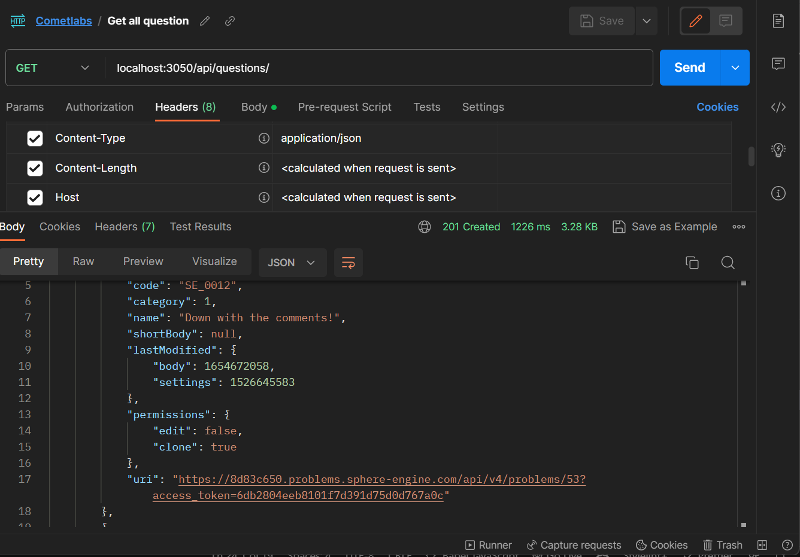
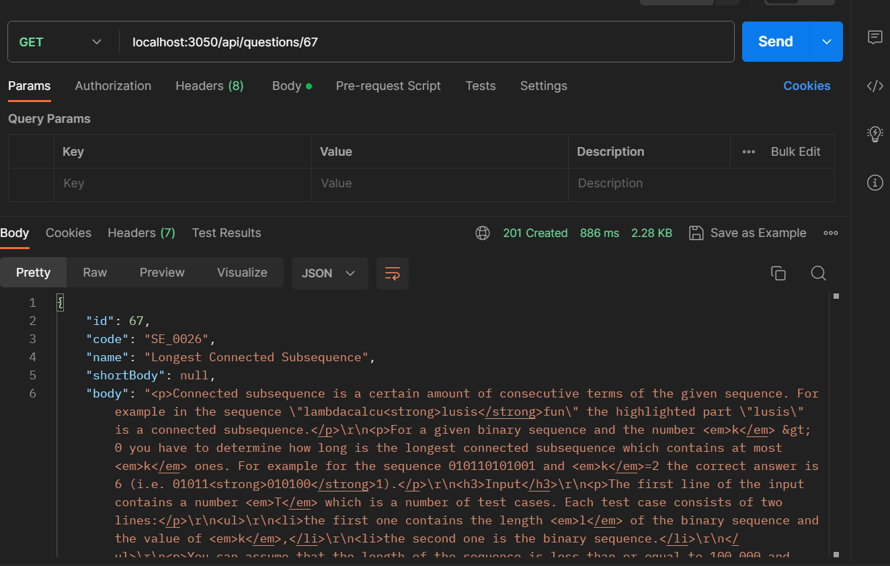
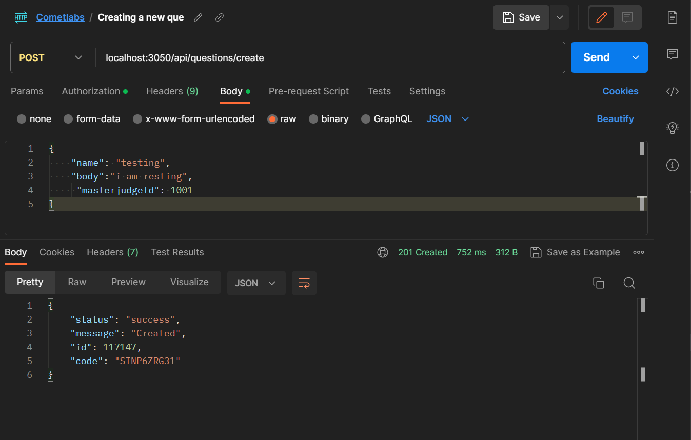
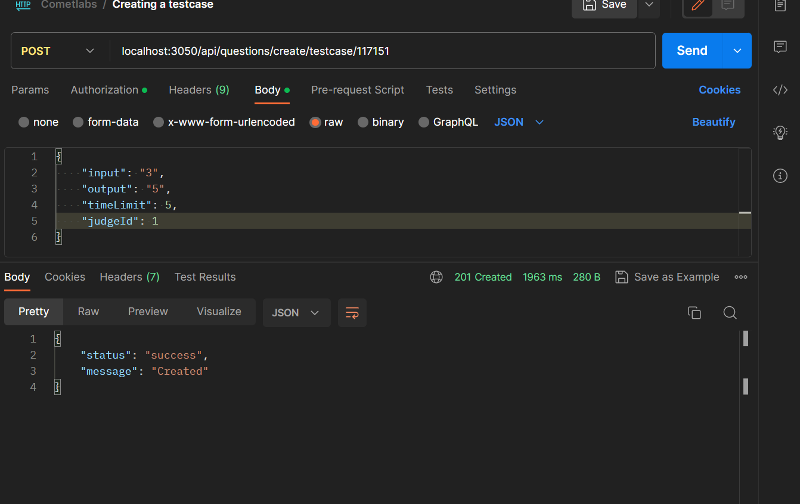
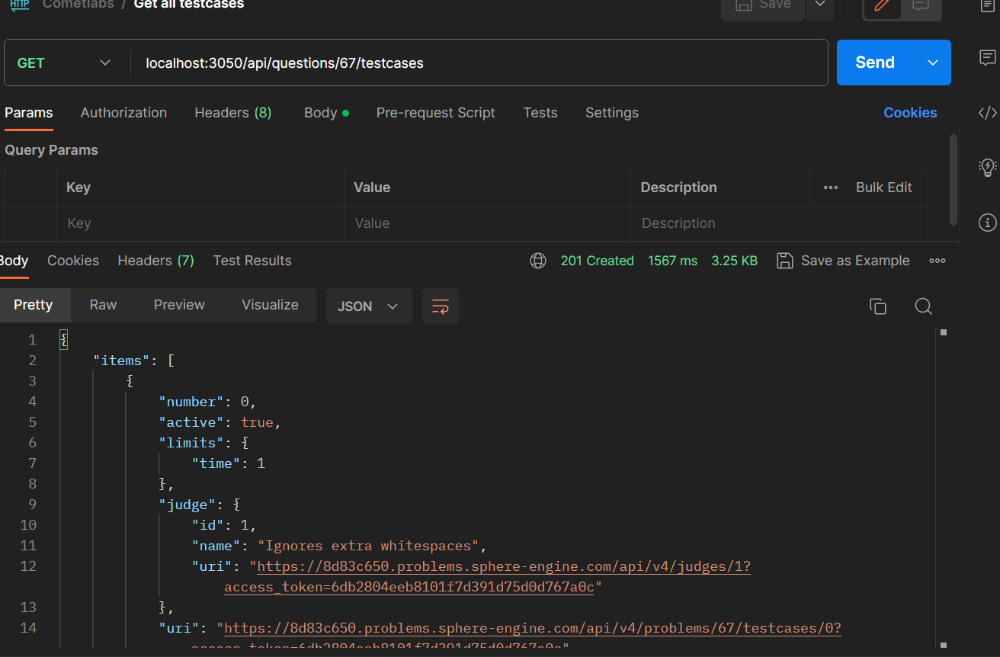
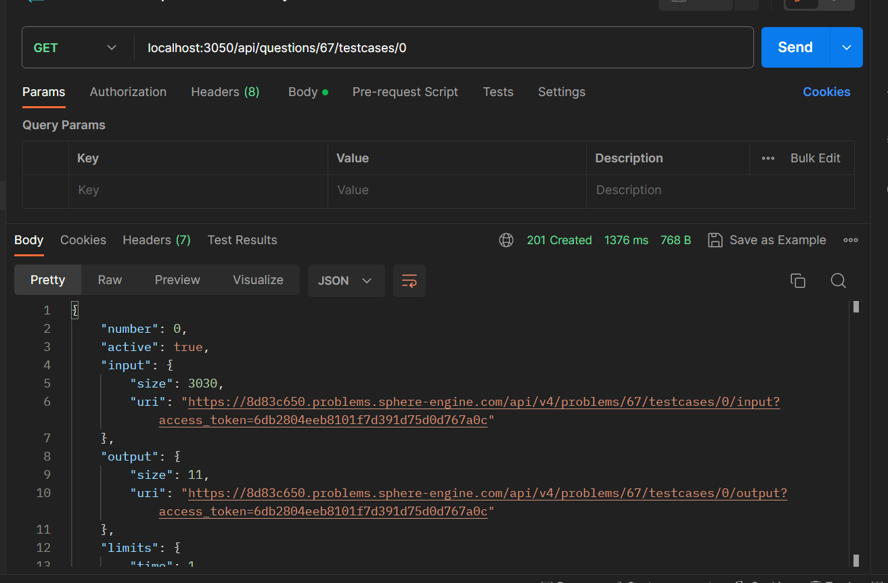
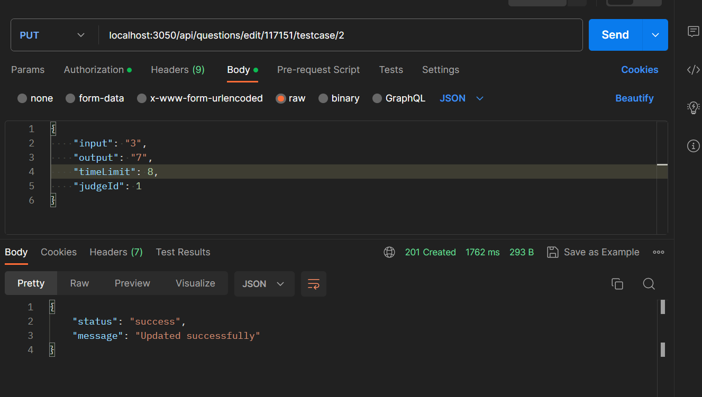
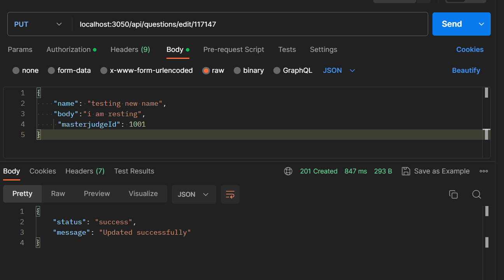
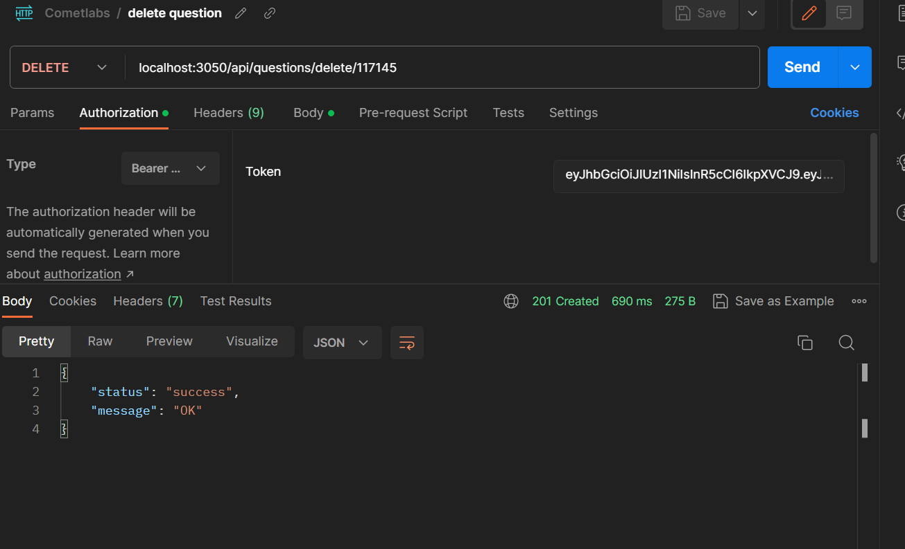
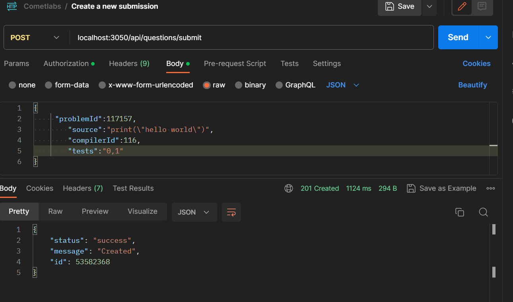

# Commetlab Assessment

This repo contains some basic apis which does the following functionalities -

- Role-based authentication system for admin and participants.
- Create a middleware to differentiate admins from participants.
- A set of APIs for the admin to add, edit or delete the question.
- Storing questions in the DB.
- A set of APIs for the admin to add test cases to a question.
- An API that takes the solution from the user for a particular question.

## How to setup

For the backend folder

1. Clone the project by and go to server folder<br>

```
git clone https://github.com/The-Developers-Den/cometlab-assessment.git
cd server
```

2. Make an env file and add your credentials

```
//In .env
PORT = 'Any Port...'
MONGO_ATLAS_PW= 'Your Mongodb Key...'
JWT_KEY = 'Your jwt private key...'
ACCESS_TOKEN = 'Your sphere-engine access token'
ENDPOINT ="Your sphere-engine endpoint token"
```

3. Install packages

```
npm i
```

3. Run server

```
npm run start
```

> Postamn docs can be accessed from [here](https://www.postman.com/navigation-observer-59279834/workspace/public-workspace/collection/23083258-d874e954-2c51-4eff-96e0-b51719d868af?action=share&creator=23083258)

## Functionalities

### 1. Authentication

1.1 Creating new User using bcrpyt <br>


1.2 Login with help of bcrpyt & jwt <br>


> Entering wrong password


### 2. Problems

2.1 Checking middleware for CRUD functionality <br>


2.2 Getting all questions <br>



2.3 Getting a question with help of id <br>



2.4 Create a new question <br>



2.5 Create a testcase question <br>



2.6 Get all testcases for a question <br>



2.7 Get particular testcase for a question <br>



2.8 Edit a testcase <br>



2.9 Edit a question <br>



2.10 Delete a question <br>



### 3. Submissions

3.1 Create a submisson <br>



3.2 Get submisson results <br>


